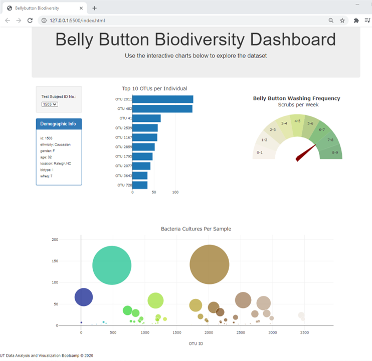
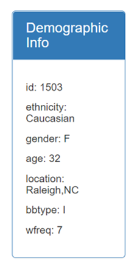
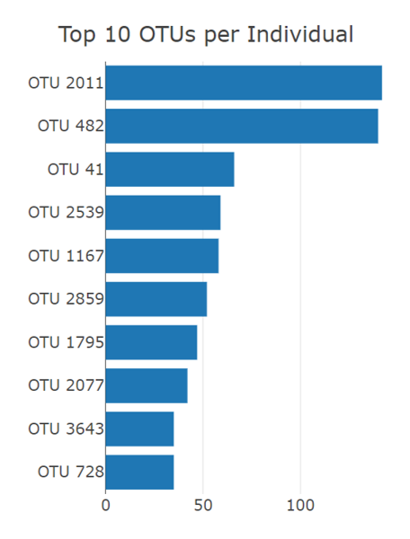
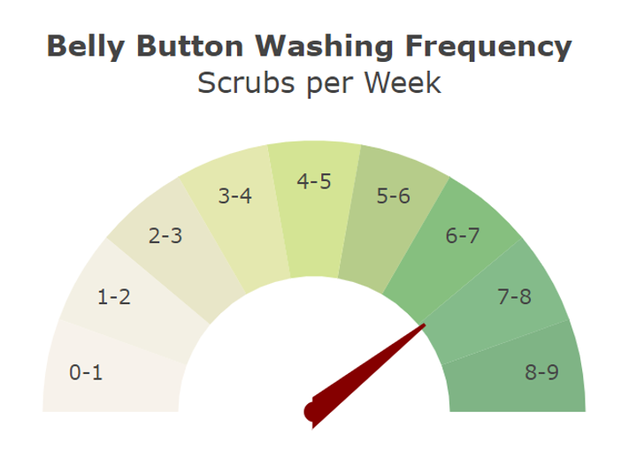
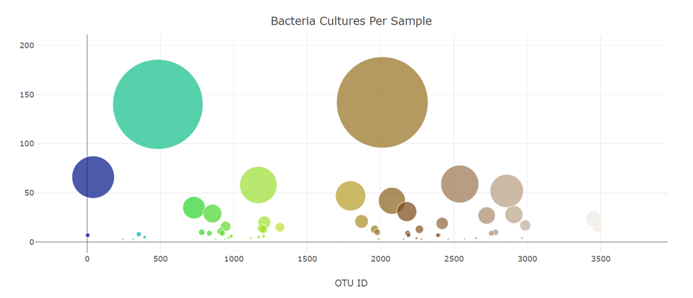

# **Plotly Challenge**
In this project, an interactive dashboard is built using Plotly to explore and visualize the Belly Button Biodiversity dataset, which catalogs the microbes that colonize human navels. The dataset reveals that a small handful of microbial species (also called operational taxonomic units, or OTUs, in the study) were present in more than 70% of people, while the rest were relatively rare.

The deployed dashboard can be viewed at: https://icode13.github.io/plotly-challenge

## **Screenshots**

## *Dashboard*

## *Demographic Info*

## *Bar Chart*

## *Gauge Chart*

## *Bubble Chart*

## About the Data
Hulcr, J. et al.(2012) *A Jungle in There: Bacteria in Belly Buttons are Highly Diverse, but Predictable.* Retrieved from: http://robdunnlab.com/projects/belly-button-biodiversity/results-and-data/

## Technologies
* JavaScript
* Plotly
* D3
* HTML
* Visual Studio Code
* Live Server

## Contact
Created by [@iCode13](https://github.com/iCode13) - please feel free to contact me in case of questions!
